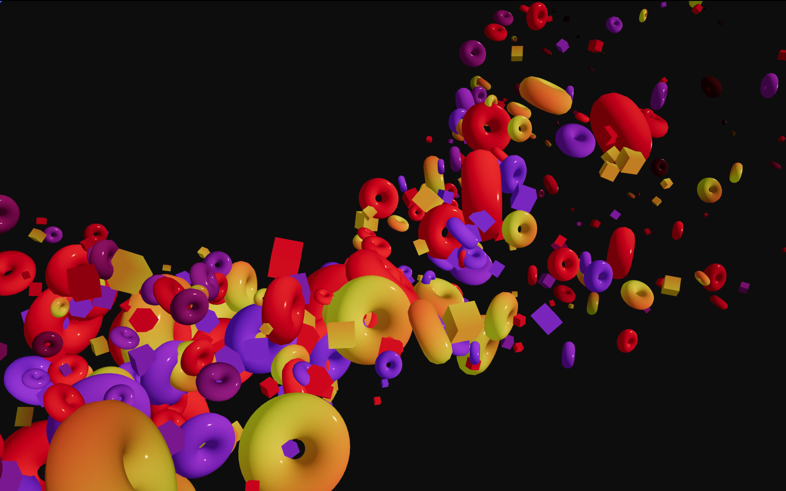

<h1 align="center">How to build 3D landing page effect using ThreeJS</h1>

<p align="center">
    <a href="https://offscreencanvas.com" target="_blank" rel="noopener noreferrer">
        
    </a>
    <a href="https://offscreencanvas.com" target="_blank" rel="noopener noreferrer">
        
    </a>
    <a href="https://offscreencanvas.com" target="_blank" rel="noopener noreferrer">
        
    </a>
</p>

[](https://www.youtube.com/watch?v=yvvLXkWFTkU)

Starter files for "How to build a 3D landing page effect using ThreeJS" Youtube tutorial

Youtube Tutorial: [Link](https://www.youtube.com/watch?v=yvvLXkWFTkU)
Live Demo: [link](https://threejsinstancing.com)
Full Course: [Link](https://threejsinstancing.com)


New learning resources/demos/articles each week in the newsletter. 

# Tutorial Code snippets 

---

```js


let ambient = new THREE.AmbientLight(0xffffff, .75)
let sun = new THREE.DirectionalLight(0xffffff, 2.0)
sun.position.set(0.5, 0.5, 0.5)

this.rendering.scene.add(sun)
this.rendering.scene.add(ambient)


```

---

```js
let uniforms = {
  uTime: uTime,
  uColors: { value: [new THREE.Color("#FFD542"), new THREE.Color("#FF4141"), new THREE.Color("#B75AFF")]}
}
material.onBeforeCompile = (shader)=>{
      shader.vertexShader = shader.vertexShader.replace("void main() {", vertexHead)
      shader.vertexShader = shader.vertexShader.replace("#include <project_vertex>", vertexBody)
			shader.uniforms = {
        ...shader.uniforms, 
        ...uniforms,
      }
    }

```
---
```js
let vertexHead = glsl`
      attribute vec4 aInstance;
			uniform float uTime;
      void main(){
      `
  let vertexBody = glsl`

      vec4 mvPosition = vec4( transformed, 1.0 );

      #ifdef USE_INSTANCING

      mvPosition = instanceMatrix * mvPosition;

      #endif

      mvPosition = modelViewMatrix * mvPosition;

      gl_Position = projectionMatrix * mvPosition;
      `;
```
---

```js
shader.fragmentShader = fragmentHead + shader.fragmentShader
shader.fragmentShader = shader.fragmentShader.replace("#include <color_fragment>", colorFragment)

```
---

```js
let fragmentHead = glsl`
  #define USE_COLOR
  varying float vColorful;

  `
  let colorFragment = glsl`
  #if defined( USE_COLOR_ALPHA )

    diffuseColor *= vColor;

  #elif defined( USE_COLOR )

    diffuseColor.rgb = mix(diffuseColor.rgb, vColor * (1. + max(vec3(0.), vColor - 0.5)), vColorful);
    // diffuseColor.rgb = vec3(vColorful);

  #endif
  `

```
---

```glsl

mat4 rotationMatrix(vec3 axis, float angle) {
      axis = normalize(axis);
      float s = sin(angle);
      float c = cos(angle);
      float oc = 1.0 - c;
      
      return mat4(oc * axis.x * axis.x + c,           oc * axis.x * axis.y - axis.z * s,  oc * axis.z * axis.x + axis.y * s,  0.0,
            oc * axis.x * axis.y + axis.z * s,  oc * axis.y * axis.y + c,           oc * axis.y * axis.z - axis.x * s,  0.0,
            oc * axis.z * axis.x - axis.y * s,  oc * axis.y * axis.z + axis.x * s,  oc * axis.z * axis.z + c,           0.0,
            0.0,                                0.0,                                0.0,                                1.0);
    }

    vec3 rotate(vec3 v, vec3 axis, float angle) {
      mat4 m = rotationMatrix(axis, angle);
      return (m * vec4(v, 1.0)).xyz;
    }

```
---

```glsl

float between(float center, float range, float val){
      return smoothstep(center - range, center, val) * smoothstep(center + range, center, val); 
    }

```
---


```glsl

transformed = rotate(transformed, normalize(vec3(0.2, 1., 0.4)), uTime * (1. * aInstance.z + 0.3)+   aInstance2.x);

```

---
## Installing & Running

```
yarn install
yarn dev
```

### Files && comments

| file | Description |
| --- | --- |
| demo.js | The meat of the demo |
| rendering.js | All the threeJS rendering |

## License
This resource can be used freely if integrated or build upon in personal or commercial projects such as websites, web apps and web templates intended for sale. It is not allowed to take the resource "as-is" and sell it, redistribute, re-publish it, or sell "pluginized" versions of it. Free plugins built using this resource should have a visible mention and link to the original work. Always consider the licenses of all included libraries, scripts and images used.

## Social

Made for [Offscreen Canvas](https://offscreencanvas.com/)
By [Daniel Velasquez @Anemolito](https://twitter.com/Anemolito)

[Twitter](https://twitter.com/Anemolito) - [Portfolio](https://velasquezdaniel.com/) - [Github](https://github.com/Anemolo) - [Offscreen Canvas](https://offscreencanvas.com/)
